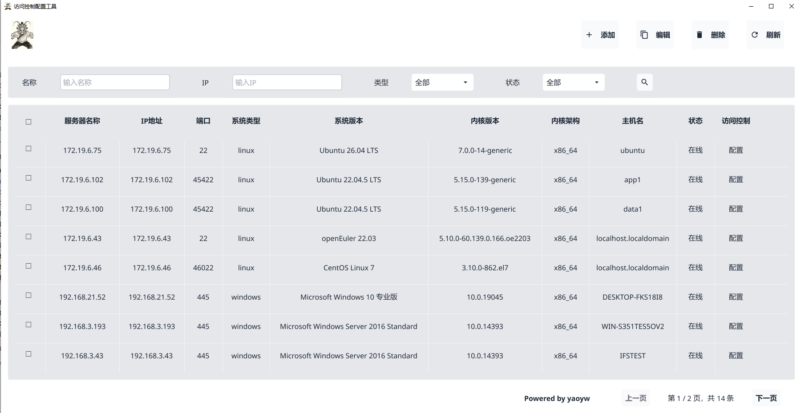
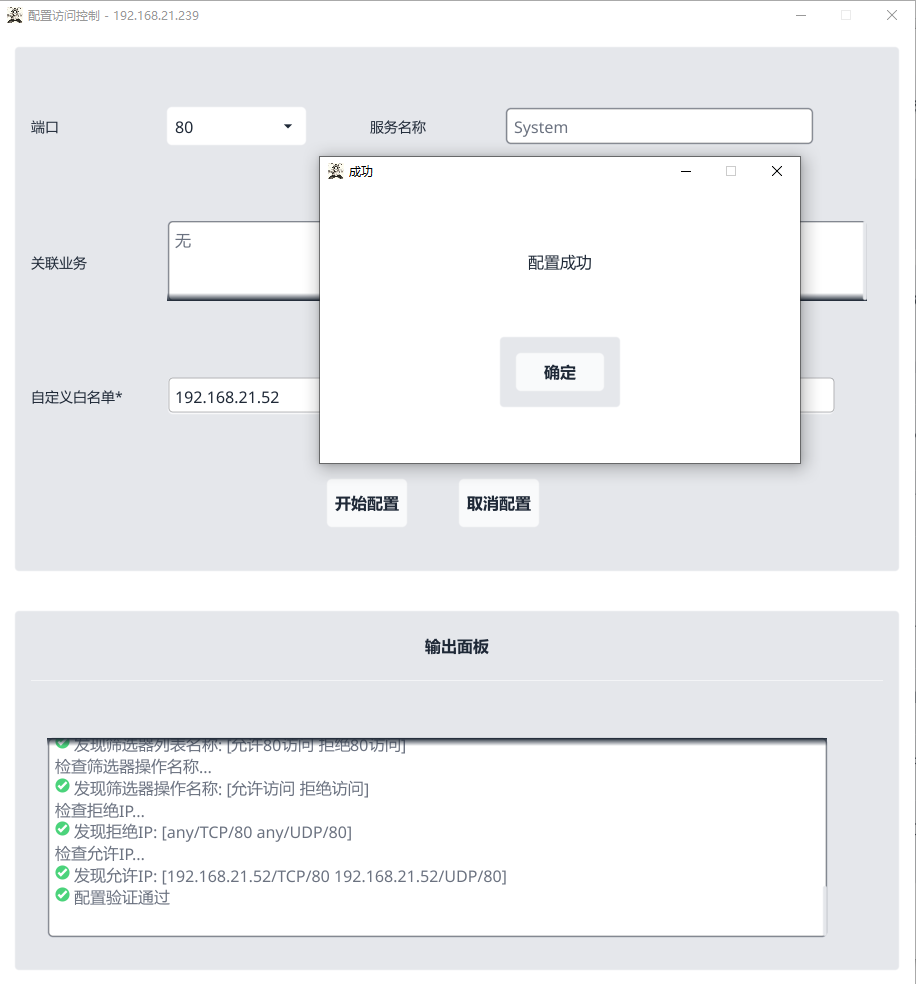
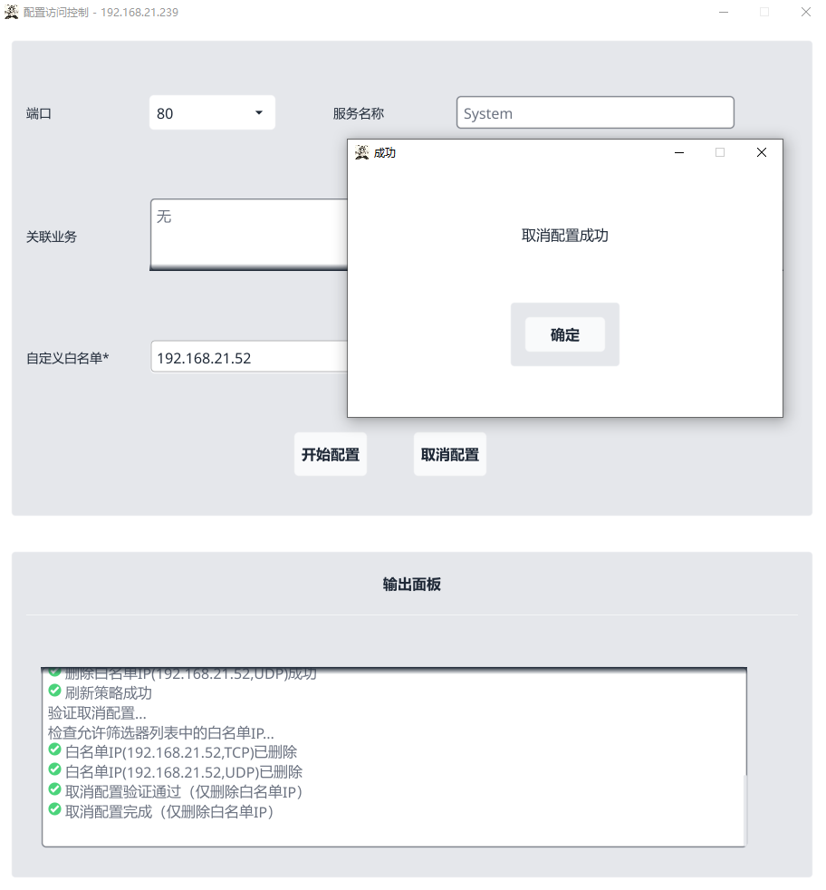
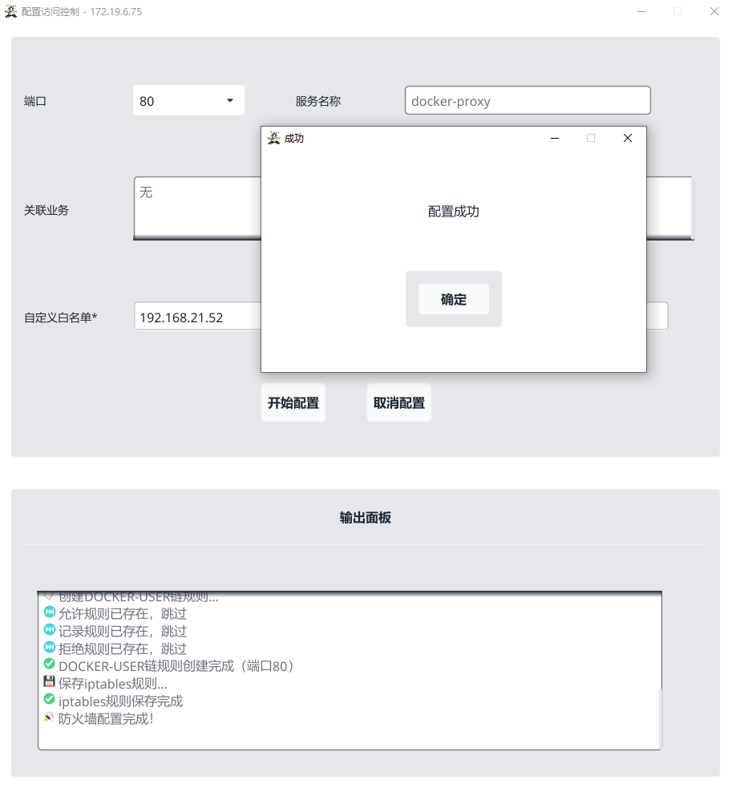
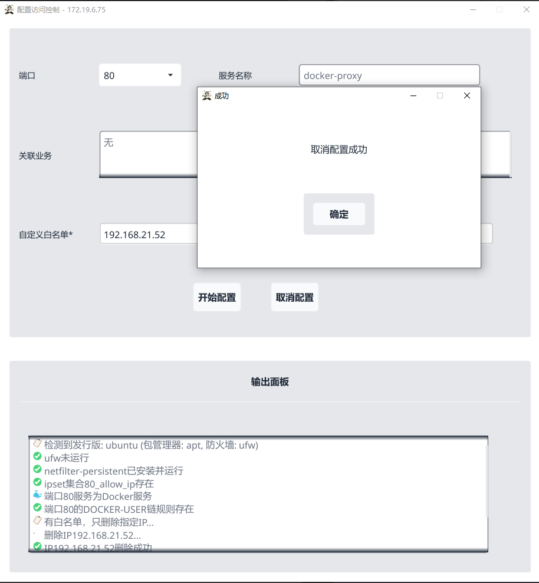

# 访问控制配置工具

基于 Go 语言开发的跨平台服务器访问控制配置工具，支持 Linux 和 Windows 系统的防火墙策略自动化配置。

## 项目简介

### 工具作用

本工具提供可视化界面，用于管理服务器并配置访问控制策略，实现服务器端口的IP白名单访问控制。

### 开发背景

随着AI时代的来临，服务器终端面临的威胁更加新颖且攻击成本更低，访问控制的重要性日益凸显。然而，由于运维人员技术能力参差不齐，传统的防火墙配置方式门槛较高。本工具通过可视化界面和自动化流程，将专业的安全配置能力转化为简单易用的操作，显著降低了访问控制的实施门槛，让普通运维人员也能轻松完成服务器安全加固。

### 主要功能

- 服务器信息管理（添加、编辑、删除、列表展示）
- 操作系统自动检测（Linux/Windows）
- 端口扫描与服务识别
- IP白名单访问控制策略配置
- 配置历史记录与审计

### 主界面预览



## 技术栈

| 分类     | 技术                  | 版本     |
| ------ | ------------------- | ------ |
| 语言     | Go                  | 1.26.4 |
| GUI框架  | Fyne                | 2.8.0  |
| 数据库    | SQLite              | 1.53.0 |
| SSH客户端 | golang.org/x/crypto | 0.53.0 |
| SMB客户端 | go-smb              | 0.11.0 |

## 功能特性

### 服务器管理

- 支持添加、编辑、删除服务器信息
- 服务器列表展示（名称、IP、操作系统、状态）
- 搜索与筛选功能
- 分页展示

### 操作系统检测

- 自动检测服务器操作系统类型（Linux/Windows）
- 获取系统版本、内核版本、架构等信息
- 检测是否为Docker容器环境

### 端口扫描

- 扫描服务器开放端口
- 识别端口对应的服务名称
- 获取已连接的客户端IP列表

### 防火墙配置

#### Linux系统

- 支持发行版：Ubuntu、Kali、CentOS、RHEL、Rocky（其他发行版使用默认配置）
- 自动检测包管理器（apt/yum）
- 自动停止并禁用firewalld/ufw，切换到iptables
- 使用ipset管理IP白名单
- Docker环境自动使用DOCKER-USER链
- 规则持久化（重启后生效）

#### Windows系统

- 使用IPsec策略配置访问控制
- 支持TCP/UDP协议
- 自动启动PolicyAgent和IKEEXT服务
- 配置验证与刷新

### 配置历史

- 自动记录每次配置操作到数据库
- 记录内容包含端口、IP白名单、执行命令、输出结果

## 快速开始

### 运行方式

#### 方式一：直接运行预编译程序

项目已提供Windows预编译版本：

```powershell
.\访问控制配置工具.exe
```

#### 方式二：源码编译运行

```powershell
# 克隆项目
git clone <repository-url>
cd 访问控制配置工具

# 安装依赖
go mod download

# 编译命令（压缩体积，推荐）
$env:GOTMPDIR="E:\go_temp"; go build -ldflags "-linkmode internal -s -w -H windowsgui" -o "访问控制配置工具.exe" ./cmd

# 运行
.\访问控制配置工具.exe
```

### 编译参数说明

| 参数                           | 说明                               |
| ---------------------------- | -------------------------------- |
| `$env:GOTMPDIR="E:\go_temp"` | 设置 Go 临时目录，避免磁盘空间不足问题            |
| `-linkmode internal`         | 使用内部链接模式，减少外部依赖                  |
| `-s`                         | 移除符号表，减小可执行文件体积                  |
| `-w`                         | 移除 DWARF 调试信息，减小可执行文件体积          |
| `-H windowsgui`              | 指定 Windows GUI 子系统，运行时不显示 CMD 窗口 |
| `-o "访问控制配置工具.exe"`          | 指定输出文件名为中文                       |
| `./cmd`                      | 指定编译入口目录                         |

## 常见问题

### 无法在虚拟机中运行

**问题现象**

在某些虚拟机环境中运行程序时，出现以下错误：

```
Fyne error:  window creation error
Cause: APIUnavailable: WGL: The driver does not appear to support OpenGL
```

**根本原因**

本工具使用 Fyne GUI 框架，该框架底层依赖 OpenGL 进行图形渲染。某些虚拟机（如深信服 SANGFOR 虚拟化平台、Bochs 等）使用的虚拟显卡驱动完全不支持 OpenGL 或仅支持非常老旧的 OpenGL 版本（低于 3.2），导致程序无法创建窗口。

**相关系统信息特征**

- 系统型号：`Standard PC (i440FX + PIIX, 1996)`
- BIOS 版本：`Bochs Bochs`
- 显示适配器：虚拟化平台提供的虚拟显卡

**解决方案**

1. **使用物理机运行**（推荐）：将程序部署在物理机上运行，物理机的显卡驱动通常完整支持 OpenGL。

2. **更新虚拟机显卡驱动**：联系虚拟化平台供应商，更新虚拟显卡驱动以支持 OpenGL 3.2 及以上版本。

3. **配置虚拟机启用 GPU 直通**：如果虚拟机平台支持，配置 GPU 直通（GPU Passthrough），让虚拟机直接使用物理显卡。

4. **尝试其他虚拟化平台**：VMware Workstation、VirtualBox 等主流虚拟化平台对 OpenGL 支持较好，可以尝试在这些平台上运行。

> **注意**：程序已在代码层面启用软件渲染模式（`FYNE_DRIVER=software`），但在某些虚拟化环境中仍可能无法正常运行，这取决于虚拟显卡驱动的兼容性。

## 使用说明

### 1. 添加服务器

1. 点击「添加」按钮
2. 填写服务器信息：
   
   - **名称**：服务器显示名称（必填）
   
   - **主机**：服务器IP地址或域名（必填，不可重复）
   
   - **远程端口**：远程管理端口（必填，详见下方端口说明）
   
   - **用户名**：登录用户名（必填）
   
   - **密码**：登录密码（必填）
3. 点击「测试连接」按钮验证连接并保存

### 2. 配置访问控制策略

1. 在服务器列表中选择目标服务器
2. 点击「配置」按钮
3. 在配置窗口中：
   
   - 选择端口（自动扫描获取）
   
   - 查看服务名称和关联业务IP
   
   - 输入自定义白名单IP（多个IP用逗号分隔，支持IP段如 `192.168.1.0/24`）
4. 点击「开始配置」执行策略配置
5. 点击「取消配置」删除策略

#### Windows系统配置

**配置访问控制**



**取消访问控制**



#### Linux系统配置

**配置访问控制**



**取消访问控制**



### 3. 编辑服务器

1. 选择要编辑的服务器
2. 点击「编辑」按钮
3. 修改服务器信息
4. 点击「测试连接」保存修改

### 4. 删除服务器

1. 选择要删除的服务器（支持多选）
2. 点击「删除」按钮
3. 确认删除操作

### 5. 搜索功能

- 按名称搜索
- 按IP地址搜索
- 按状态筛选
- 按操作系统类型筛选

## 端口说明

### Linux服务器

| 端口     | 用途        | 是否必填          |
| ------ | --------- | ------------- |
| **22** | SSH远程管理端口 | 必填（在添加服务器时填写） |

> **注意**：防火墙配置时使用的端口是扫描到的开放业务端口，而非SSH端口。

### Windows服务器

| 端口      | 用途                   | 是否必填      |
| ------- | -------------------- | --------- |
| **445** | SMB远程管理端口（在添加服务器时填写） | 必填        |
| **135** | RPC端点映射器（WMI连接必需）    | 自动使用，无需填写 |

> **注意**：工具会根据填写的端口自动检测服务类型（SSH/SMB），端口445直接识别为SMB服务。

## 目录结构

```
访问控制配置工具/
├── cmd/                           # 主入口
│   ├── icons/                     # 应用图标资源
│   │   ├── logo_16.png
│   │   ├── logo_32.png
│   │   ├── logo_48.png
│   │   ├── logo_64.png
│   │   ├── logo_128.png
│   │   └── logo_256.png
│   ├── winres/                    # Windows资源配置
│   │   ├── icon.png
│   │   ├── icon16.png
│   │   └── winres.json
│   ├── logo.ico
│   ├── logo.png
│   ├── main.go                    # 主函数
│   ├── rsrc_windows_386.syso      # 32位Windows资源文件
│   └── rsrc_windows_amd64.syso    # 64位Windows资源文件
├── internal/                      # 内部模块
│   ├── db/                        # 数据库操作
│   │   └── db.go
│   ├── detector/                  # 系统检测
│   │   ├── detector.go
│   │   ├── detector_linux_impl.go
│   │   └── detector_windows.go
│   ├── firewall/                  # 防火墙配置
│   │   ├── firewall.go
│   │   ├── firewall_linux_impl.go
│   │   └── firewall_windows.go
│   ├── models/                    # 数据模型
│   │   └── models.go
│   ├── portscanner/               # 端口扫描
│   │   ├── portscanner.go
│   │   ├── portscanner_linux_impl.go
│   │   └── portscanner_windows.go
│   ├── service/                   # 业务逻辑层
│   │   └── service.go
│   ├── smb/                       # SMB客户端（Windows远程管理）
│   │   └── smb.go
│   ├── ssh/                       # SSH客户端（Linux远程管理）
│   │   └── ssh.go
│   ├── ui/                        # 用户界面
│   │   ├── components.go
│   │   ├── config_window.go
│   │   ├── logo.png
│   │   ├── mainwindow.go
│   │   ├── pagination.go
│   │   ├── search_panel.go
│   │   ├── server_dialog.go
│   │   ├── server_table.go
│   │   ├── theme.go
│   │   └── window_pos.go
│   └── utils/                     # 工具函数
│       ├── conn.go
│       └── crypto.go
├── data.db                        # SQLite数据库文件
├── debug.log                      # 调试日志
├── go.mod                         # Go模块依赖
├── go.sum                         # 依赖校验
├── logo.ico                       # 应用图标
├── logo.png                       # 应用图标
├── Linux访问控制流程图.png         # Linux配置流程图
├── Linux配置访问控制策略指南.md    # Linux配置指南
├── Windows访问控制流程图.png       # Windows配置流程图
├── Windows配置访问控制策略指南.md  # Windows配置指南
├── 复盘指南.md                    # 复盘指南
└── 访问控制配置工具.exe            # Windows预编译程序
```